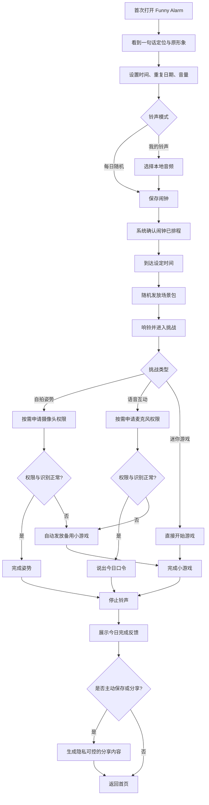
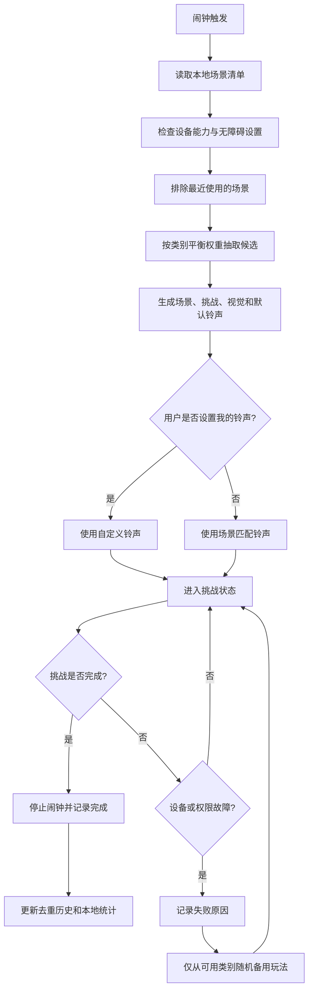
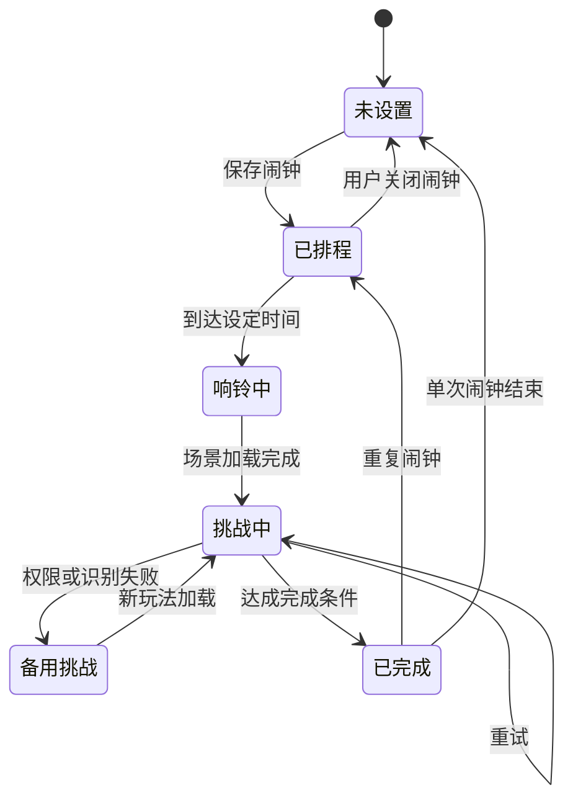

# Funny Alarm 产品需求文档

- 文档版本：v0.1
- 更新日期：2026-07-22
- 产品阶段：概念验证 -> 移动端 MVP
- 当前原型：[voice_alarm.html](../voice_alarm.html)

## 1. 产品定义

Funny Alarm 是一个每天随机发放晨间互动的创意闹钟。用户只设置时间、重复日期、音量和铃声模式，不选择具体玩法；闹钟响起时，系统随机组合场景、铃声和挑战，用户完成挑战后闹钟才停止。

一句话定位：**你永远不知道，今天会怎样开始。**

它不是自律惩罚工具，也不是“更凶的闹钟”。核心价值是：

1. 让半睡半醒的人真正参与一个短动作，脱离机械关闹钟的状态。
2. 用每天不同的场景制造期待感，让普通早晨多一点生活趣味。
3. 让完成过程天然可记录、可分享，但不强迫拍摄或公开隐私。

## 2. 产品原则

1. **随机由产品发放**：用户不能勾选自拍、语音或游戏类型，避免形成机械习惯。
2. **场景是一整套体验**：挑战、铃声、文案、颜色和完成反馈应属于同一主题。
3. **可爱而不幼稚**：语气轻松、俏皮，不羞辱用户，不用“懒惰”“失败”等惩罚性表达。
4. **短而有效**：目标完成时间 15-60 秒，不能让晨间挑战变成负担。
5. **权限最小化**：摄像头和麦克风仅在对应挑战出现时申请；默认本地处理、不上传原始音视频。
6. **失败必有退路**：设备、权限或识别失败时自动提供备用小游戏，但普通用户不能通过反复切换挑选喜欢的挑战。

## 3. 目标用户与场景

### 3.1 核心用户

| 用户 | 典型问题 | 产品机会 |
| --- | --- | --- |
| 18-30 岁学生、初入职场者 | 会无意识关闭普通闹钟；早八、通勤压力大 | 用短互动打断肌肉记忆 |
| 喜欢新鲜感和可爱表达的人 | 普通闹钟每天完全相同，缺乏期待 | 每日随机场景与声音 |
| 轻度赖床但不喜欢“惩罚式自律”的人 | 数学题、超大音量令人烦躁 | 用好玩、低负担的方式叫醒 |
| 情侣、室友、内容创作者 | 早晨反应有趣，但缺少稳定内容触发器 | 可选择生成分享卡或短视频模板 |

### 3.2 不作为当前目标

- 不宣称治疗失眠、嗜睡、ADHD 或其他医学问题。
- 不替代医疗级睡眠监测、智能唤醒或安全报警设备。
- 首版不做复杂睡眠分析、社区信息流和开放式 AI 聊天。

## 4. 核心体验

### 4.1 随机场景包

每个场景包必须包含：

- 场景名称和主题文案
- 挑战类别：自拍姿势、语音互动、迷你游戏之一
- 对应挑战规则和完成反馈
- 默认铃声或旋律
- 视觉配色和原形象的状态变化
- 能力要求：摄像头、麦克风或无权限
- 难度、预计时长和备用方案

MVP 至少准备 18 个场景包，每类 6 个。连续两次不重复同一场景，连续三天尽量不重复同一挑战动作。

### 4.2 三类玩法

#### A. 自拍姿势

- 前置摄像头显示实时预览。
- 屏幕给出简单、可爱、适合半身画面的姿势，例如托脸、举手伸懒腰、比心、歪头微笑。
- 端侧姿态/表情识别连续满足约 1.5 秒后完成。
- 默认不拍照、不保存、不上传；完成后可由用户主动选择保存一张照片。
- 光线不足、摄像头不可用或连续识别失败时切换无权限小游戏。

#### B. 语音互动

- 屏幕显示 5-12 个字的短句、拟声词或角色口令。
- 识别关键短语即可完成，不要求逐字一致。
- 优先使用端侧语音识别；默认不保存音频。
- 麦克风不可用、环境太吵或识别连续失败时切换无权限小游戏。

#### C. 迷你游戏

- 单局 15-45 秒，可单手完成。
- MVP 包含颜色顺序、节拍跟随、快速分类、滑动路径等轻量玩法。
- 不使用复杂数学题作为默认方向，避免回到惩罚式闹钟体验。
- 游戏是所有设备的兜底玩法，必须离线可用。

### 4.3 铃声规则

- 默认“每日随机”：铃声随随机场景一起发放，声音与主题匹配。
- 用户可以选择“我的铃声”：自定义铃声覆盖场景默认声音，但挑战仍随机。
- 音量支持设置和渐强；挑战完成前不提供永久静音。
- 为听觉安全提供一次 10 秒降音量，倒计时结束后恢复设置音量。

## 5. 用户流程图

## 6. 随机引擎逻辑图

## 7. 状态机

## 8. 功能需求

### 8.1 P0：移动端 MVP

| 编号 | 功能 | 需求 | 验收标准 |
| --- | --- | --- | --- |
| P0-01 | 闹钟排程 | 支持单次、每周重复、启停和编辑 | App 关闭或处于后台时仍由系统按时触发 |
| P0-02 | 随机引擎 | 系统随机发放，不展示玩法勾选项 | 100 次抽样中三类玩法均出现；不连续重复场景 |
| P0-03 | 随机场景铃声 | 默认铃声与场景绑定 | 进入场景后展示的铃声名与实际声音一致 |
| P0-04 | 自定义铃声 | 用户可从本地选择声音 | 自定义铃声不改变挑战随机逻辑 |
| P0-05 | 自拍姿势 | 前摄预览、端侧识别、完成判定 | 姿势连续满足约 1.5 秒后停止响铃 |
| P0-06 | 语音互动 | 短句展示、关键字识别、重试 | 命中任一核心关键字即可完成 |
| P0-07 | 迷你游戏 | 至少 4 种离线小游戏 | 单局目标完成时间不超过 45 秒 |
| P0-08 | 故障兜底 | 权限拒绝、硬件缺失、识别超时处理 | 2 秒内提示原因并随机切换可用小游戏 |
| P0-09 | 完成页 | 场景反馈、原形象成功状态、返回首页 | 仅完成挑战后停止铃声并进入完成页 |
| P0-10 | 隐私与权限 | JIT 权限申请、本地处理说明、数据删除入口 | 未出现相关挑战前不申请摄像头或麦克风 |
| P0-11 | 离线能力 | 已下载场景和小游戏离线运行 | 断网时闹钟、随机、挑战和本地铃声可用 |
| P0-12 | 可用性保护 | 电量、音量、权限、系统排程自检 | 设置页明确显示“明天能否正常响铃”状态 |

### 8.2 P1：验证后增强

- 7 日早晨回顾和连续完成记录。
- 由用户主动开启的完成照片/短视频保存。
- 一键生成 9:16 分享模板，默认遮挡时间、房间环境等敏感信息。
- 好友互发“明早场景包”，但接收者仍不知道具体内容。
- 节日、城市、IP 或创作者主题包。
- 根据完成时长自动调节难度，但不破坏随机性。

### 8.3 暂不开发

- 公开社区和无限内容流。
- 用户自行勾选挑战类型。
- 云端保存原始摄像头视频或麦克风录音。
- 以羞辱、扣款、公开失败为机制的惩罚玩法。
- 医疗诊断、睡眠阶段预测和治疗建议。

## 9. 关键异常与安全规则

1. **系统权限被撤销**：设置页显示不可用；触发时直接从无权限小游戏随机发放。
2. **环境不适合拍摄/说话**：提供“设备或环境有问题”入口，只能随机切换到可用类别，不能挑选。
3. **连续识别失败**：两次明确提示后自动切换，不让铃声无限持续。
4. **紧急退出**：长按 8 秒进入安全退出，需二次确认并记录“未完成”；不能把安全出口设计成隐藏手势。
5. **耳机或外放异常**：按系统输出通道处理，并提供渐强与短时降音量，避免突发高音量。
6. **低电量/勿扰/系统限制**：前一晚进行可用性自检并提示修复路径。
7. **换时区与夏令时**：重复闹钟按用户当地时间；单次闹钟显示明确时区。

## 10. 数据与隐私

### 10.1 默认仅保存在本机

- 闹钟时间、重复日期、音量、铃声模式
- 最近场景 ID、完成时长、失败原因、连续完成天数
- 用户主动选择保存的照片或视频

### 10.2 默认不采集

- 摄像头原始视频流
- 麦克风原始音频
- 房间图像、联系人、精确位置
- 与产品功能无关的设备信息

### 10.3 分享规则

- 分享必须由用户在完成后主动触发。
- 保存照片/视频与发布到社媒分为两次明确动作。
- 分享模板默认不展示具体住址、实时位置和完整起床时间。
- 未成年人模式默认关闭影像保存和公开分享引导。

## 11. 指标体系

### 11.1 北极星指标

**每周成功完成随机开场的活跃用户数（WWC）**。

它同时要求闹钟能可靠触发、挑战能完成、用户愿意持续使用，优于单纯下载量或闹钟创建量。

### 11.2 MVP 目标值

| 指标 | 目标 |
| --- | --- |
| 系统闹钟触发成功率 | >= 99.9% |
| 挑战完成率 | >= 90% |
| 挑战完成时长 P50 / P90 | <= 35 秒 / <= 90 秒 |
| 因权限或识别失败触发备用玩法比例 | <= 12% |
| 次日仍保留至少一个有效闹钟 | >= 55% |
| D7 留存 | >= 25% |
| 完成后主动保存或分享比例 | >= 8% |
| 安全退出率 | <= 3% |

目标值用于首轮验证，不作为对外宣传承诺。

## 12. 埋点事件

- `alarm_created`, `alarm_updated`, `alarm_disabled`
- `alarm_triggered`, `alarm_delivery_failed`
- `scene_assigned`, `challenge_started`, `challenge_retried`
- `permission_requested`, `permission_denied`
- `fallback_started`, `challenge_completed`, `safety_exit`
- `completion_saved`, `share_template_created`, `share_clicked`

严禁在埋点中包含语音内容、照片、视频帧和用户自定义铃声文件名。

## 13. 技术落地建议

当前 HTML 适合作为交互原型，不适合作为最终闹钟运行载体：浏览器页面被挂起或关闭后，无法保证持续可靠地在指定时间触发。

- iOS 26+ 优先使用 Apple AlarmKit；官方文档说明它支持一次性和每周重复排程，并能在必要时突破静音与专注模式。[Apple AlarmKit](https://developer.apple.com/documentation/AlarmKit) / [排程示例](https://developer.apple.com/documentation/AlarmKit/scheduling-an-alarm-with-alarmkit)
- Android 使用系统 `AlarmManager.setAlarmClock` / exact alarm，并正确处理精确闹钟权限。[Android AlarmManager](https://developer.android.com/reference/kotlin/android/app/AlarmManager)
- 自拍识别优先采用端侧成熟方案，如 Apple Vision 或 MediaPipe/ML Kit；语音优先采用系统端侧能力。
- 场景资源、小游戏和兜底规则必须随 App 打包，避免断网时无法关闭闹钟。

建议先做 iOS 26+ 原生 MVP 验证核心体验，再根据数据决定 Android 并行投入；如果需要双端同步开发，UI 层可以共享，但闹钟排程和前后台生命周期必须保留原生实现。

## 14. 发布门槛

1. 连续 14 天、至少 20 台真机排程测试无漏响。
2. 飞行模式、锁屏、重启、低电量、静音、专注模式和换时区测试通过。
3. 三类挑战分别完成不少于 100 次内部测试。
4. 摄像头和麦克风权限拒绝场景可在 2 秒内进入备用玩法。
5. 安全退出、无障碍和隐私说明经独立检查。
6. 原形象、文案和铃声资源完成版权确认。

## 15. 待验证问题

1. 用户更期待“完全未知”，还是希望提前知道明天属于自拍/语音/游戏中的哪一类？当前原则为完全未知。
2. 15-60 秒的挑战是否足以清醒，又不会导致烦躁？
3. 自拍玩法的分享意愿是否高于语音和小游戏？
4. 自定义铃声会不会削弱场景完整感？
5. 用户完成后是否仍会回床，需要不要增加一个可选的“离床后续动作”？

